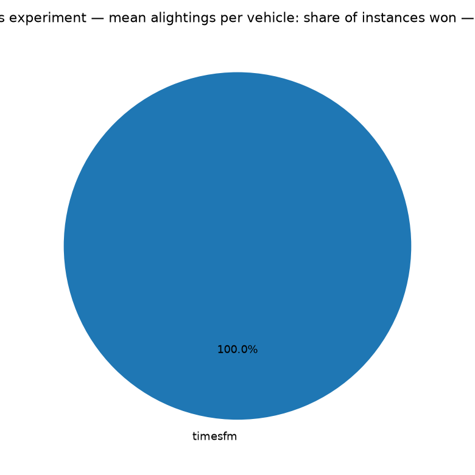
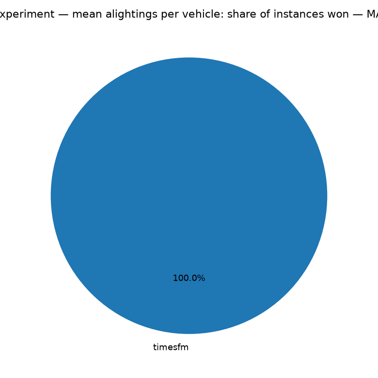

# Rates experiment — mean alightings per vehicle — method comparison

Instances: **334 stops** | methods: timesfm. Metrics computed only where y_true is observed; MAPE excludes y_true = 0 points.

## Overall metrics (all instances pooled, weighted by points)

| method   |   n_points |    mse |    mae |   mape_pct |
|:---------|-----------:|-------:|-------:|-----------:|
| timesfm  |     187064 | 1.7401 | 0.5352 |    68.7916 |

## Win rates (per stops: lowest error wins; ties split equally)

### MSE

- **timesfm**: won 100.0% of stops

### MAE

- **timesfm**: won 100.0% of stops

### MAPE (%)

- **timesfm**: won 100.0% of stops

