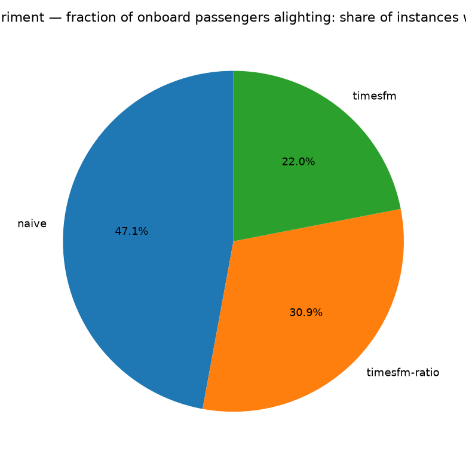
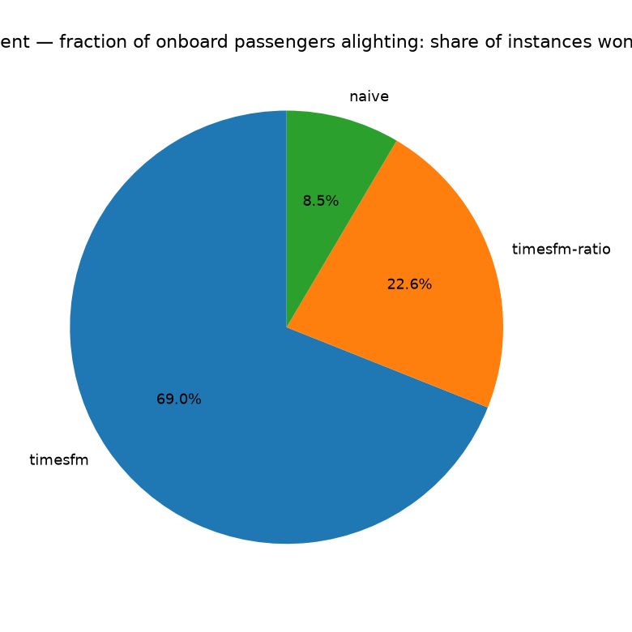
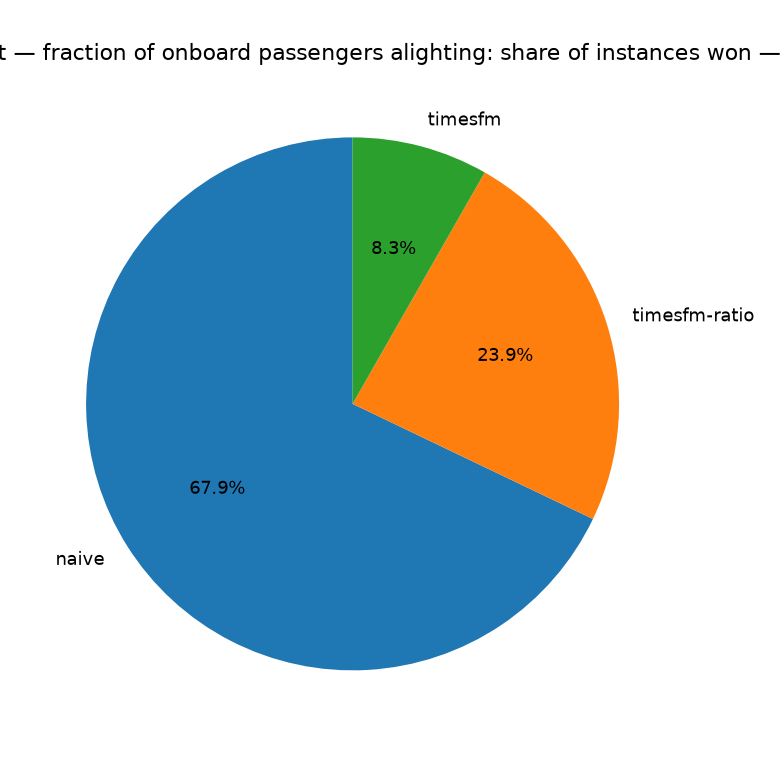

# Rates experiment — fraction of onboard passengers alighting — method comparison

Instances: **334 stops** | methods: naive, timesfm, timesfm-ratio. Metrics computed only where y_true is observed; MAPE excludes y_true = 0 points.

## Overall metrics (all instances pooled, weighted by points)

| method        |   n_points |    mse |    mae |   mape_pct |
|:--------------|-----------:|-------:|-------:|-----------:|
| naive         |     187064 | 0.0059 | 0.0295 |    63.5872 |
| timesfm       |     187064 | 0.0055 | 0.0258 |    69.1933 |
| timesfm-ratio |     187064 | 0.0056 | 0.0265 |    67.6583 |

## Win rates (per stops: lowest error wins; ties split equally)

### MSE

- **naive**: won 47.1% of stops
- **timesfm-ratio**: won 30.9% of stops
- **timesfm**: won 22.0% of stops

### MAE

- **timesfm**: won 69.0% of stops
- **timesfm-ratio**: won 22.6% of stops
- **naive**: won 8.5% of stops

### MAPE (%)

- **naive**: won 67.9% of stops
- **timesfm-ratio**: won 23.9% of stops
- **timesfm**: won 8.3% of stops

