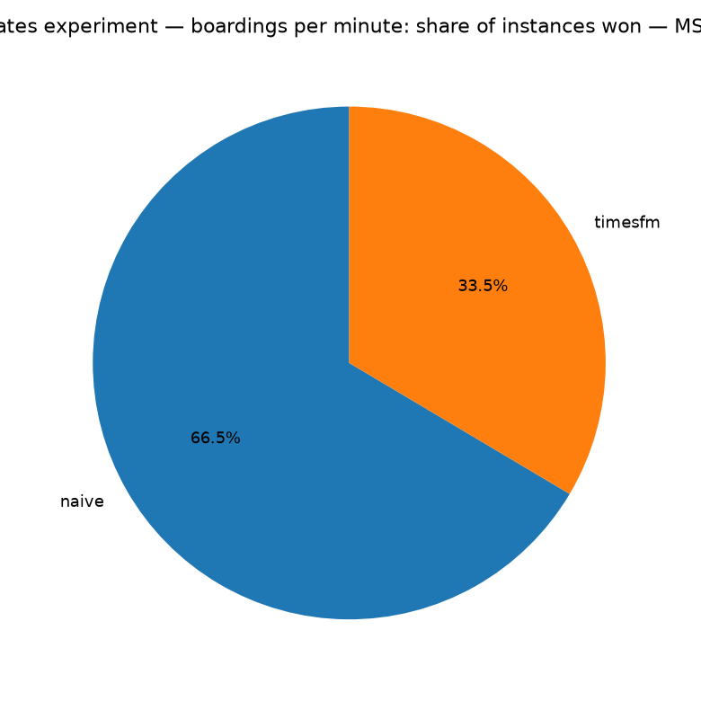
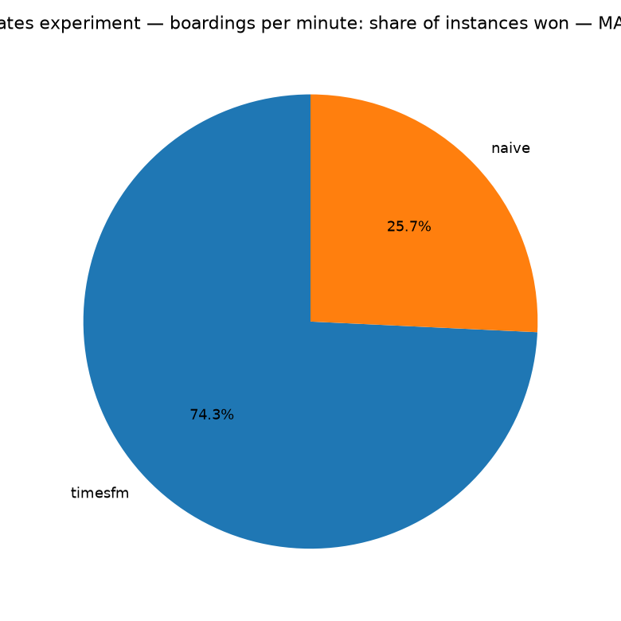
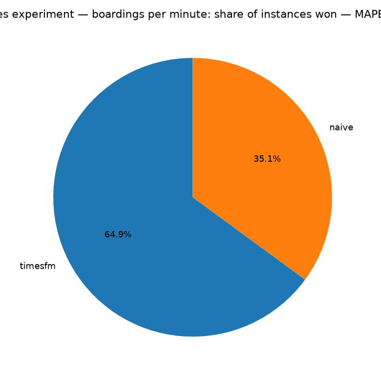

# Rates experiment — boardings per minute — method comparison

Instances: **334 stops** | methods: naive, timesfm. Metrics computed only where y_true is observed; MAPE excludes y_true = 0 points.

## Overall metrics (all instances pooled, weighted by points)

| method   |   n_points |    mse |    mae |   mape_pct |
|:---------|-----------:|-------:|-------:|-----------:|
| naive    |     187064 | 0.0093 | 0.0414 |    75.3959 |
| timesfm  |     187064 | 0.0083 | 0.0384 |    71.4649 |

## Win rates (per stops: lowest error wins; ties split equally)

### MSE

- **naive**: won 66.5% of stops
- **timesfm**: won 33.5% of stops

### MAE

- **timesfm**: won 74.3% of stops
- **naive**: won 25.7% of stops

### MAPE (%)

- **timesfm**: won 64.9% of stops
- **naive**: won 35.1% of stops

